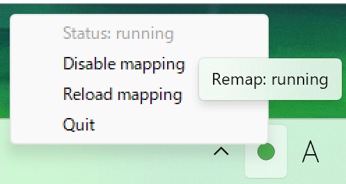

# my-interception

Small helper to remap CapsLock/LCTRL/F13 combos via the Interception driver, with a tray UI for enable/disable, reload, and quit. Single-instance lock prevents multiple launches.

## 機能
- CapsLock を LCTRL に変換し、LCTRL/F13 を修飾キーとして利用
- F13+各キーで矢印・ファンクションキー等へリマップ
- F13+F / F13+J で IME を OFF/ON（PowerToys 側の追加リマップ不要）
- Alt+Shift 組み合わせでワード移動などのショートカット送出
- タスクトレイから Enable/Disable・Reload・Quit を操作
- 多重起動防止（TEMP のロックファイルを使用）

## 必要なもの
- Interception driver インストール済みであること
- Windows 10/11
- Python 3.11+（仮想環境は `setup.bat` が作成）

## セットアップ
1) `setup.bat` を実行して仮想環境と依存関係を準備
2) Interception driver が有効になっていることを確認

## 起動方法
- 通常（トレイ有効・コンソールなし）: `launch-hidden.bat`
- デバッグログ付き（コンソール表示）: `launch-debug.bat`
- トレイなしで直接実行: `python remap-260104.py --no-tray`

## トレイメニュー
- Status: 現在状態と有効/無効を表示
- Enable/Disable mapping: マッピングのオン/オフ切り替え（オフ中は素通し、アイコンがグレー）
- Reload mapping: ループを再起動して設定を反映
- Quit: 即終了しアイコンも消去

## スタートアップ登録
- `add-startup.bat` を管理者不要で実行すると `%APPDATA%\Microsoft\Windows\Start Menu\Programs\Startup` にショートカットを作成します。

## 既知の注意点
- デバイス ID 1 のキーボードのみを対象としています。複数キーボードを扱う場合はコードのフィルタを調整してください。
- Interception 待ち受けが止まらない場合に備え、Quit/Reload 時はコンテキストを強制解放しています。
- IME の切り替えは Windows API の `SendInput` で `VK_IME_ON` / `VK_IME_OFF` を注入しています。
	- 64bit Windows では `INPUT` 構造体サイズが重要です（ctypes 側で `MOUSEINPUT`/`HARDWAREINPUT` を含む union を定義しないと `SendInput` が失敗し、ログは出ても IME が切り替わりません）。

## 開発メモ
- 依存: `requirements.txt` (interception, pystray, Pillow など)
- 多重起動防止: `%TEMP%\my-interception.lock`
- DEBUG_KEYS=1 で CapsLock/LCTRL/F13/A をログ
